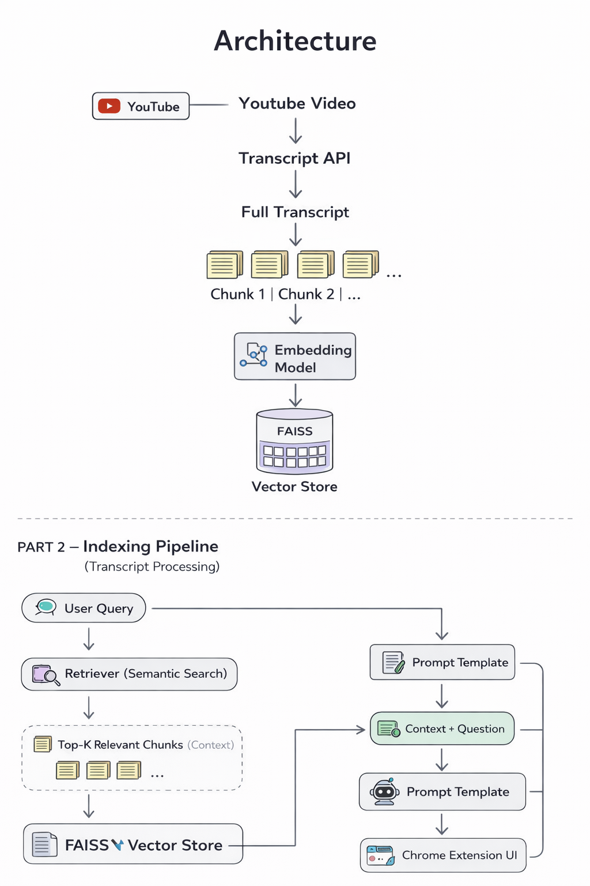

# YT_Video_Doubt_Assistant – RAG

This app is a Chrome Extension powered by a FastAPI + RAG backend that allows users to ask contextual questions about the current playing YouTube video.
Instead of generic summaries, it answers specific doubts using the video's transcript.

---

##  Features

- 🔍 Ask any question about a YouTube video
- 🧠 Retrieval-Augmented Generation (RAG)
- 📄 Transcript-based contextual answers
- ⚡ FAISS vector search for relevant chunks
- 🤖 HuggingFace LLM integration
- 🎨 Modern SaaS-style Chrome extension UI
- ⌨️ Press Enter to submit query
- 🔐 Secure backend (API keys not exposed)

---

## Pipeline + Architecture

---

##  How It Works 

When a user asks a question:

1. Extension extracts the YouTube `video_id`
2. Backend fetches transcript via `youtube-transcript-api`
3. Transcript is split using `RecursiveCharacterTextSplitter`
4. Chunks are embedded using HuggingFace embeddings
5. FAISS builds a vector index
6. Retriever fetches top 4 relevant chunks
7. Context + User Question → Prompt Template
8. Prompt sent to HuggingFace LLM
9. LLM generates contextual answer
10. Answer returned to Chrome extension UI
---

## To Use as chrome Extension:

🛠️ Backend Setup
python -m venv venv->
venv\Scripts\activate->
pip install -r requirements.txt->

### Create .env inside backend:
HUGGINGFACEHUB_API_TOKEN=your_token_here

### Run backend:
uvicorn main:app --reload->
Open:http://127.0.0.1:8000/docs

### 🌐 Load Chrome Extension

Open chrome://extensions->
Enable Developer Mode->
Click "Load unpacked"->
Select extension folder->
Ensure backend is running
